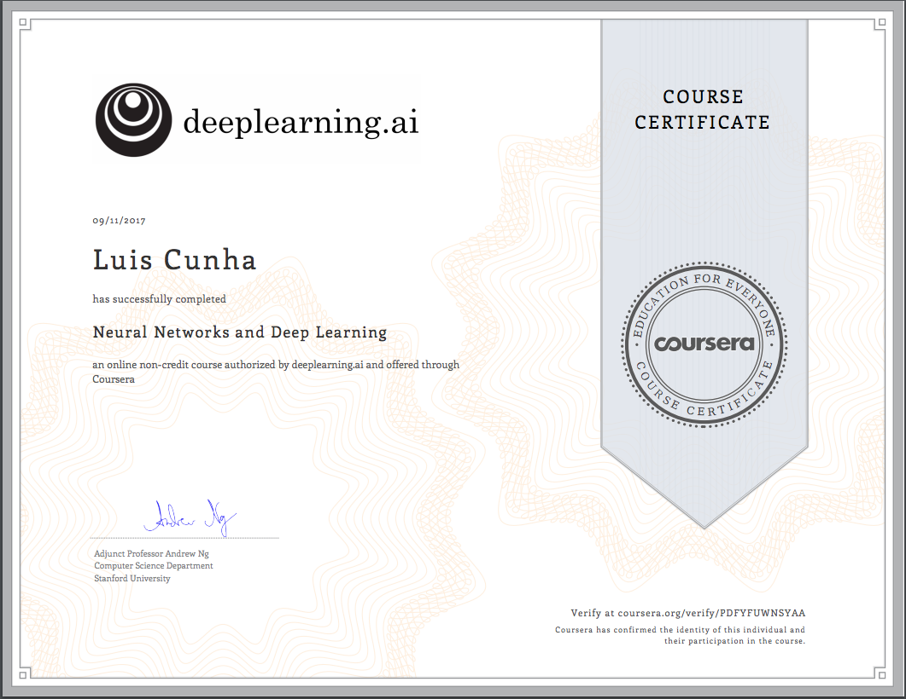

# Deep learning Specialization - Coursera

#### By [deeplearning.ai](https://www.deeplearning.ai/) -  Master Deep Learning, and Break into AI

[Specialization url](https://www.coursera.org/specializations/deep-learning)

Instructor: [Andrew Ng](http://www.andrewng.org/)

## Course 1 

### Neural Networks and Deep Learning
[course link](https://www.coursera.org/specializations/deep-learning)

[Syllabus](https://github.com/lfcunha/Deep_learning_specialization-coursera/blob/master/Course1-Neural_Networks_and_Deep_Learning/readme.md)

### Programming assignments:

- [Week 2 - P1 - Python and Numpy basics](https://github.com/lfcunha/Deep_learning_specialization-coursera/blob/master/Course1-Neural_Networks_and_Deep_Learning/week2-nn_setup/Python%2BBasics%2BWith%2BNumpy%2Bv3.ipynb)
- [Week 2 - P1 - Logistic Regression with a Neural Network mindset](https://github.com/lfcunha/Deep_learning_specialization-coursera/blob/master/Course1-Neural_Networks_and_Deep_Learning/week2-nn_setup/Logistic%2BRegression%2Bwith%2Ba%2BNeural%2BNetwork%2Bmindset%2Bv3.ipynb)
- [Week 3 - P2 - Planar data classification with one hidden layer](https://github.com/lfcunha/Deep_learning_specialization-coursera/blob/master/Course1-Neural_Networks_and_Deep_Learning/week3-1_layer_nn/Planar%2Bdata%2Bclassification%2Bwith%2Bone%2Bhidden%2Blayer%2Bv3.ipynb)
- [Week 4 - P3 - Building your Deep Neural Network: Step by Step](https://github.com/lfcunha/Deep_learning_specialization-coursera/blob/master/Course1-Neural_Networks_and_Deep_Learning/week4-build_dnn/Building%2Byour%2BDeep%2BNeural%2BNetwork%2B-%2BStep%2Bby%2BStep%2Bv4.ipynb)
- [Week 4 - P4 - Deep Neural Network for Image Classification: Application](https://github.com/lfcunha/Deep_learning_specialization-coursera/blob/master/Course1-Neural_Networks_and_Deep_Learning/week4-build_dnn/Deep%2BNeural%2BNetwork%2B-%2BApplication%2Bv3.ipynb)

## Course 2:
 ### Improving Deep Neural Networks: Hyperparameter tuning, Regularization and Optimization
[course link](https://www.coursera.org/learn/deep-neural-network/)

### Programming assignments:

## Course 3:

## Course 4:

### Certificates of Completion:
